# 
 <b> :paw_prints: Ankitty :paw_prints: </b> 

  

> [!NOTE]
> This project is a fork of [Ankite](https://github.com/Swiddis/Ankite) by [Simeon Widdis](https://github.com/Swiddis)

*Ankitty* is a minimalist Anki template I use for my English vocabulary flashcards.

I maintain it primarily for the personal usage, but keep it public in case anyone would find it cool enough to add it to their study arsenal.

As the original creator states:
> *...it's designed mostly with language learning in mind, but at a glance there shouldn't be much in the way of using it for other subjects*

### :star: Core features
- Centered cards (was pain in the ass to set up)
- Adjustable color schemes
- Dark & light mode compatibility
- Mobile support

### :sparkles: Fork enhancements

- More stylish color schemes
- Boosted study buddies' envy level
- Aesthetic wallpapers included

## :hammer_and_wrench: Installation

You have 2 options:

### :package: Ready-made deck

Example card pack to demonstrate all the features.  
Just [download](https://github.com/satanori/Ankitty/raw/refs/heads/main/ankitty.apkg) and import to your collection.

### :card_index_dividers: Template files

Layout templates you can manually add to your cards and customize as you wish :cherry_blossom:

  
HTML & CSS
 

  - Find source files [here](/templates)
  - Open 'Manage Note Types' (`Ctrl` + `Shift` + `N`), then 'Cards', and copy-paste the code from each template file to the corresponding field

  
Fields
 
  
  Go to 'Manage Note Types', then 'Fields', and add fields to make the fields list look like this:

  

    
  

  
Font
 
  
  - Locate font files [here](./fonts)
  - Follow the [Anki Manual on Installing Fonts](https://docs.ankiweb.net/templates/styling.html#installing-fonts)

  
Wallpapers
 

  - Move the [wallpapers](./wallpapers) folder to your Anki profile directory (`%APPDATA%\Anki2` on Windows)  
  - Your styling template should automatically load the correct wallpaper then

## :framed_picture: Overview

### 
 <i> · Light themes · </i> 

  <a>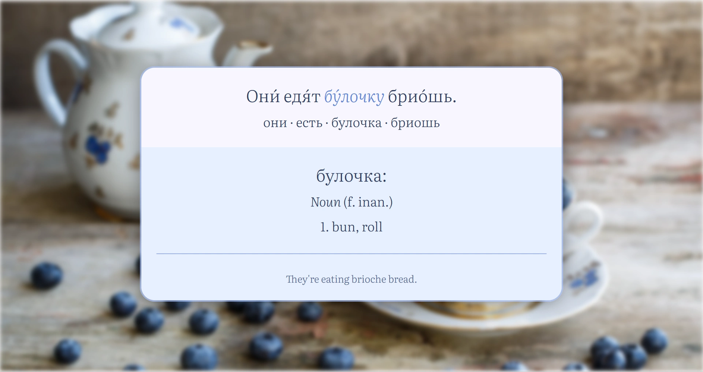</a>
  <a>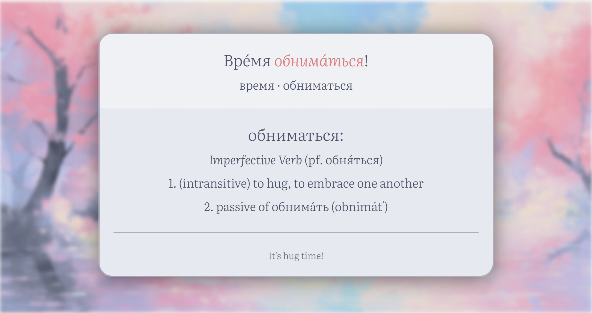</a>

  <a>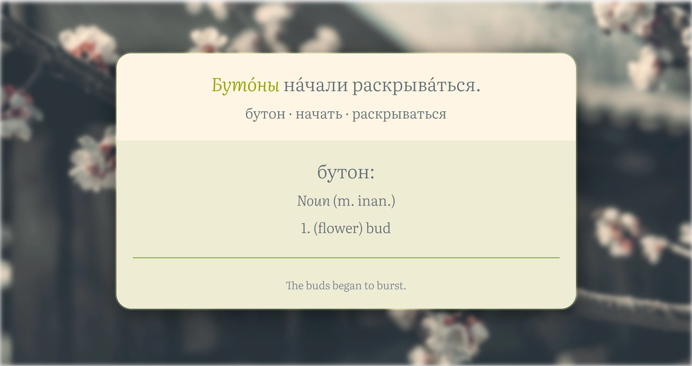</a>
  <a>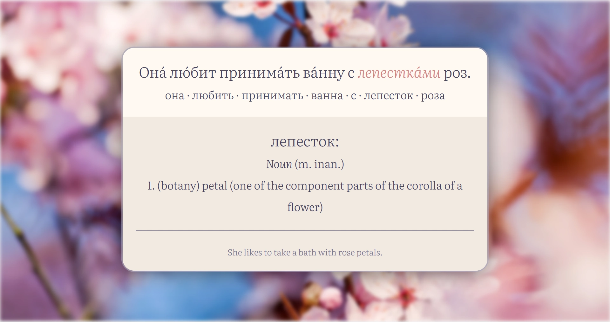</a>

### 
 <i> · Dark themes · </i> 

  <a>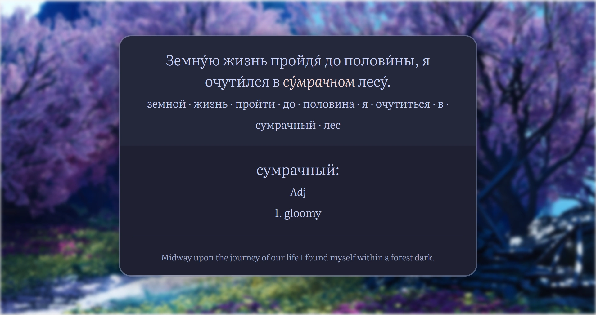</a>
  <a>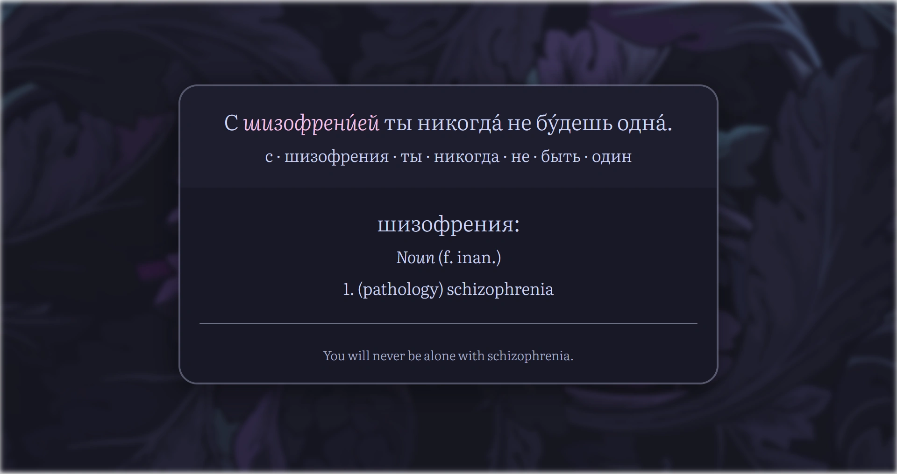</a>

  <a>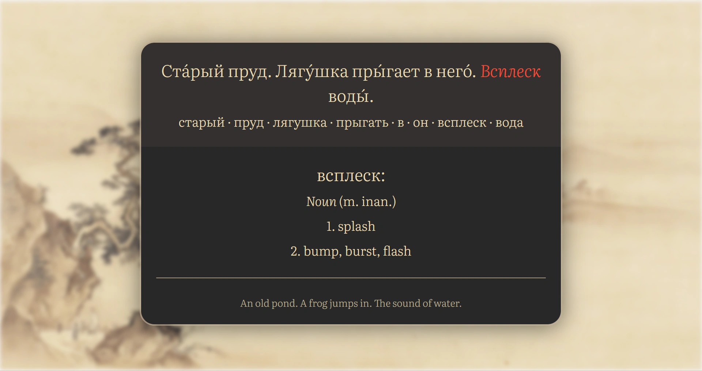</a>
  <a>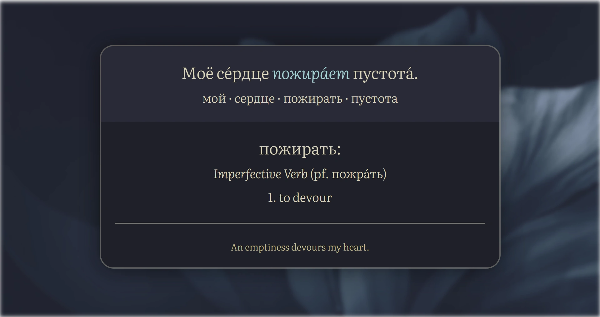</a>

  <a>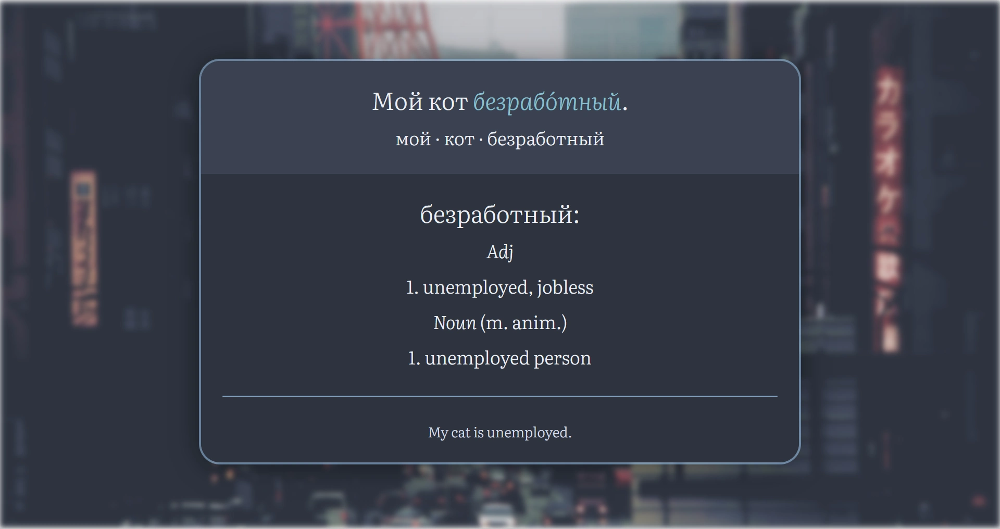</a>
  <a>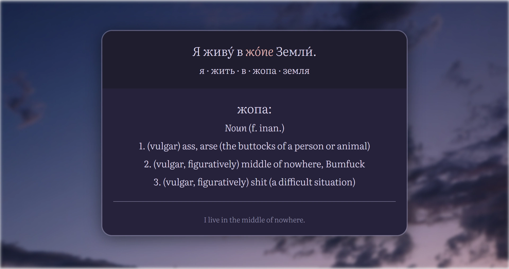</a>

  <a>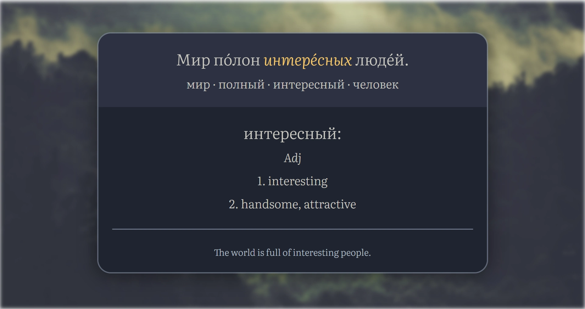</a>
  <a>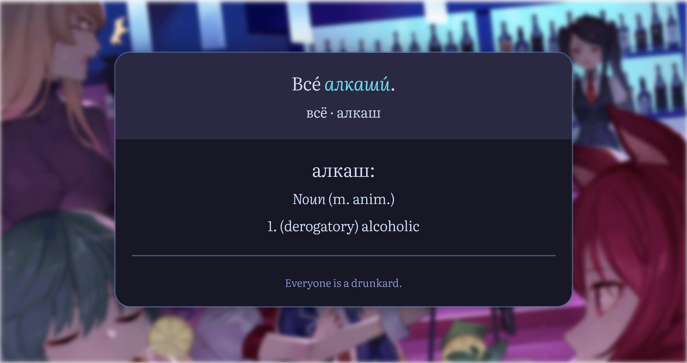</a>

## :scroll: Licensing

This project is licensed under the MIT license, see [`LICENSE`](./LICENSE) for details.  
The [Literata](https://github.com/googlefonts/literata) font used in this project is licensed under the OFL-1.1 license.

Images used as [wallpapers](./wallpapers) were gathered from all over the Internet, so their original sources are unknown.  
If you are the rightful owner of any of the provided images and would like your name to be mentioned, or your work to be fully removed from this project, please contact me via email: [nuska.arbuzka@gmail.com](mailto:nuska.arbuzka@gmail.com)
